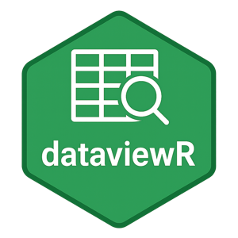

```{r, include = FALSE}
knitr::opts_chunk$set(
  collapse = TRUE,
  comment = "#>"
)
```

# Welcome to dataviewR

{ width=30% }


```{r setup}
library(dataviewR)
```


`dataviewR` is a Shiny-based interactive viewer for R data frames and tibbles. It allows you to:

- Select and view columns easily
- Apply complex filters
- Sort and search within data
- Auto-generate `dplyr` code based on your interactions
- View attribute information of data objects

## Installation

You can install `dataviewR` from CRAN (replace with actual if published):

```r
install.packages("dataviewR")
```

Or from GitHub (if applicable):

```r
# install.packages("devtools")
devtools::install_github("madhankumarnagaraji/dataviewR")
```

## Basic Usage

Let's try viewing the built-in `mtcars` dataset:

```r
dataviewR::dataviewer(mtcars)
```

This will launch an interactive Shiny app where you can explore the dataset.

## Features

### Column Selection

Easily select the columns you want to view or analyze.

### Filtering

Apply complex filters on your data to focus on subsets.

### Sorting and Searching

Sort your data by columns and search for values.

### Code Generation

As you interact with the app, `dataviewR` generates the corresponding `dplyr` code, helping you reproduce your steps programmatically.

## Session Info

```r
sessionInfo()
```
